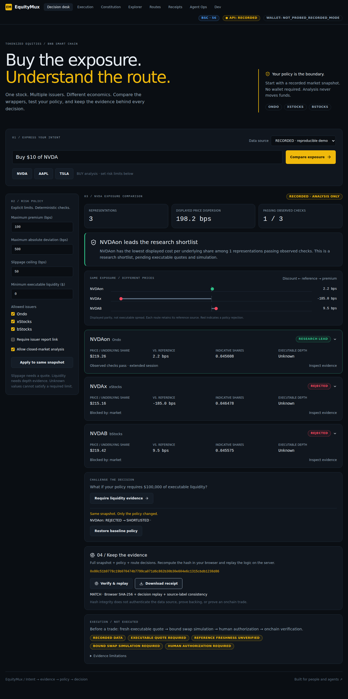
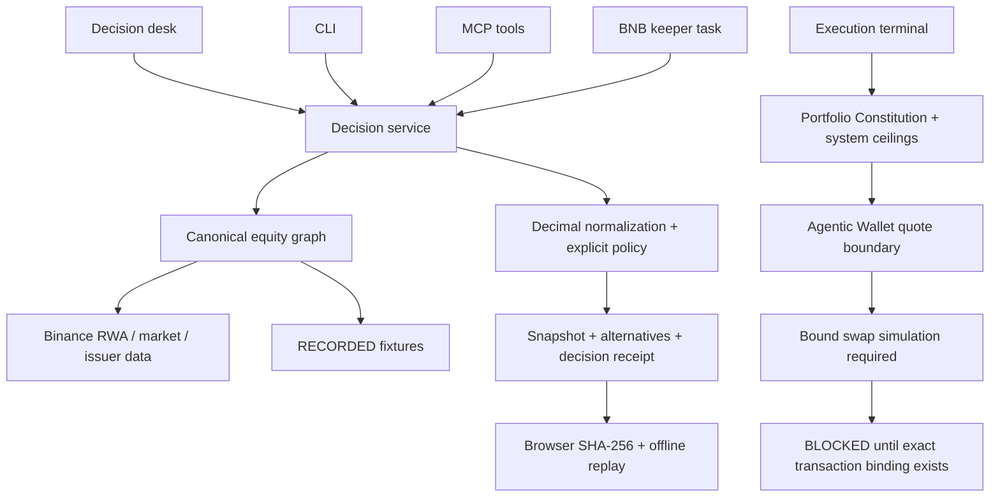

# EquityMux

**Buy the exposure. Understand the route. Keep the evidence.**

EquityMux compares tokenized stock exposure across **Ondo, xStocks and bStocks
on BNB Smart Chain**. Give it an intent, inspect normalized prices and policy
checks, challenge the decision against the same market snapshot, and export a
receipt that anyone can replay.

> “Buy $10 of NVDA.” Which NVIDIA token actually fits your policy?

**Try the judge loop:** `pnpm demo` — recorded data, no keys, no wallet, no funds.
Open the decision desk with `pnpm dev:api` and `pnpm dev:web`.

**Hosted research demo:** [equitymux.tangvu.dev](https://equitymux.tangvu.dev)
— recorded analysis, no wallet or mainnet execution. Runs on the builder's machine
through PM2 and Cloudflare Tunnel; see [hosting operations](docs/hosting.md).

Built for [BNB Hack: Tokenized Stocks Edition](https://www.bnbchain.org/en/hackathons/tokenized-stocks).



## Why this exists

The same company trades through different token contracts, issuers and share
multipliers. Comparing token prices alone can select the wrong economic
exposure. A low price may also reflect stale data, a closed market or a large
parity gap. Market capitalization is not executable liquidity.

EquityMux normalizes **price per underlying share**, applies explicit issuer,
premium, absolute parity and market policies, and explains every rejection.
Unknown depth remains unknown. If your policy requires depth evidence that the
feed does not provide, the correct result is **NO_VALID_ROUTE**.

## A complete decision loop

1. Enter a BUY intent, such as `Buy $10 of NVDA`.
2. Discover BSC representations through Binance public RWA endpoints.
3. Normalize token price by shares per token; retain reference provenance.
4. Compare displayed prices and evaluate explicit policy checks.
5. Require $100,000 of executable liquidity against the **same snapshot**.
6. Inspect the changed outcomes, download the receipt, and replay it offline.

This is a **market-data shortlist**, not an executable quote or a promise of
best execution. Fees, gas, market impact, reference freshness and actual depth
must be established before any trade. The current wallet adapter cannot bind a
swap simulation to the later submitted transaction, so execution fails closed.

## Quickstart

Prerequisites: Node 22+, pnpm 11, Python 3.12+ and uv. Foundry is needed only for
the notary contract tests. The Python environment is selected by uv.

```bash
git clone --recurse-submodules https://github.com/tang-vu/equitymux
cd equitymux
pnpm install --frozen-lockfile
cd services/api
uv sync --frozen
cd ../..
pnpm demo
pnpm dev:api
# another terminal
pnpm dev:web
```

Visit `http://localhost:3000`. The decision desk defaults to RECORDED evidence
independently of the API's default mode. Choose LIVE explicitly to fetch market
data; failed live requests never silently fall back to fixtures.

Containerized: `docker compose up --build`. See [deployment guide](docs/deployment-guide.md).
No public deployment or mainnet execution is implied by running locally.

## Interfaces for agents

Agents need typed outcomes and explicit blockers rather than a provider name
buried in prose. The UI, CLI and MCP adapter call the same deterministic service.

```bash
pnpm cli plan 'Buy $10 of NVDA' --out decision.json
pnpm cli replay decision.json
pnpm cli plan 'Buy $10 of AAPL' --live
pnpm mcp
```

CLI paths are relative to `services/api` when invoked through pnpm. The demo
writes both baseline and strict-policy receipts into `data/judge-demo/`.

REST example:

```bash
curl http://localhost:8000/api/decisions -H "Content-Type: application/json" \
  -d '{"text":"Buy $10 of NVDA","mode":"recorded","policy":{"max_premium_bps":"100"}}'
```

| Endpoint / tool | Purpose |
|---|---|
| `POST /api/decisions` / `analyze_exposure` | Capture evidence and compare exposure |
| `POST /api/decisions/compare` / `compare_policy` | Reevaluate the identical snapshot under a new policy |
| `POST /api/decisions/replay` / `replay_decision` | Check hash, decision reproduction and provenance consistency |
| `POST /api/agent/tasks` with `ANALYZE_EXPOSURE` | Keeper-compatible task returning the same decision bundle |
| `GET /api/explore/{ticker}` | Provider-level market evidence |
| `/docs` on the API | OpenAPI schemas and interactive requests |

MCP stdio configuration (replace the absolute path):

```json
{"mcpServers":{"equitymux":{"command":"uv","args":["--directory","/absolute/path/equitymux/services/api","run","python","-m","equitymux.mcp_server"]}}}
```

The MCP server exposes **no signing, trading, payment or policy-approval tool**.
See [agent interfaces](docs/agent-interfaces.md) for exact payloads.

## Supported providers and evidence

| Rail | Discovery | Normalization | Evidence limits |
|---|---|---|---|
| Ondo | Binance RWA type 1, BSC only | Explicit shares multiplier | Report links do not independently verify backing |
| xStocks | Binance RWA type 2, BSC only | Explicit shares multiplier | Independent reference may be unavailable |
| bStocks | Binance RWA type 3, BSC only | Explicit shares multiplier | Peer references are labeled |

RECORDED fixtures cover NVDA, AAPL and TSLA. Live discovery follows the upstream
catalog; historical catalog counts are not advertised as current coverage.
Issuer redemption, legal rights and counterparty risk are not interchangeable
and are not scored as if verified. The decision desk reports those limitations.

## Architecture



`apps/web`: Next.js UI. `services/api`: FastAPI, policy, graph and receipt logic.
`services/keeper`: BNB Agent Studio scaffold and bounded task delivery.
`packages/contracts`: non-custodial receipt notary; no funds or routing authority.

## Safety and receipts

- `EXECUTION_ENABLED=false` remains the default. Recorded data cannot execute.
- Natural-language parsing supports a limited BUY grammar; use visible structured
  policy fields for constraints. This build does not call an LLM.
- Market-data policies produce shortlists. The execution Constitution and system
  ceilings remain a separate, stricter boundary and cannot be loosened by a demo.
- Slippage and liquidity are not synthesized from market cap or volume.
- A quote and balance probe do **not** qualify as swap simulation.
- A confirmation boolean is not authentication. Public multi-user execution is
  not supported; use the application for analysis until that boundary is built.
- Decision receipts embed input snapshot, source digest for fixtures, policy,
  normalized comparisons, rejections and explicit execution status.
- SHA-256 uses sorted canonical JSON with ASCII escaping and excludes the hash
  field. Browser/Python parity is tested. Integrity is not a signature, upstream
  authentication, proof of backing, or proof of execution.
- Existing execution receipts and the notary contract are preserved. Neither
  a local receipt nor a testnet notary proves a mainnet stock purchase.

## BNB and sponsor integration

Binance public RWA discovery, market state, issuer metadata and price endpoints
are used directly. The Agentic Wallet CLI adapter provides a real quote/order
boundary but needs wallet authentication and a correctly bound simulation path.
BNB Agent Studio has a canonical scaffold and domain task hook; hosted identity,
autonomous runtime and paid settlement are separate deployment requirements.
The existing x402 challenge is **not a completed payment integration**.

## Demo and checks

[Three-minute judge script](docs/demo-script.md) ·
[winner research and adoption matrix](docs/research/winner-dna.md) ·
[current validation](docs/validation.md)

```bash
pnpm lint
pnpm typecheck
pnpm test:api
pnpm test:web
pnpm format:check
pnpm test:contracts
pnpm build
pnpm test:e2e
pnpm demo
```

API tests include recorded fixture integration, tampered receipts, policy
counterfactuals and a real MCP stdio client/server round trip. Browser E2E checks
the complete recorded decision flow. See validation for checks actually run.

## Current limitations and next milestones

1. **Execution:** implement a quote-to-calldata binding, authenticated approval,
   idempotent submission and verified resulting position before an authorized
   small mainnet demo. Current swaps deliberately stop at simulation.
2. **Market integrity:** source timestamps and executable depth need additional
   validated feeds. No all-in-cost or guaranteed-liquidity claim is made today.
3. **Hosting:** publish an accessible web/API deployment and verify uptime
   through judging. Local configuration is supplied; public hosting is not assumed.
4. **Agent Studio:** register and host the keeper, then verify paid delivery if
   that integration is used for a special prize.
5. **DX report:** the participant must write their actual experience. Existing
   raw events can support it; this task does not generate a submission DX report.

MIT · [Contributing](CONTRIBUTING.md) · [Security](SECURITY.md)
