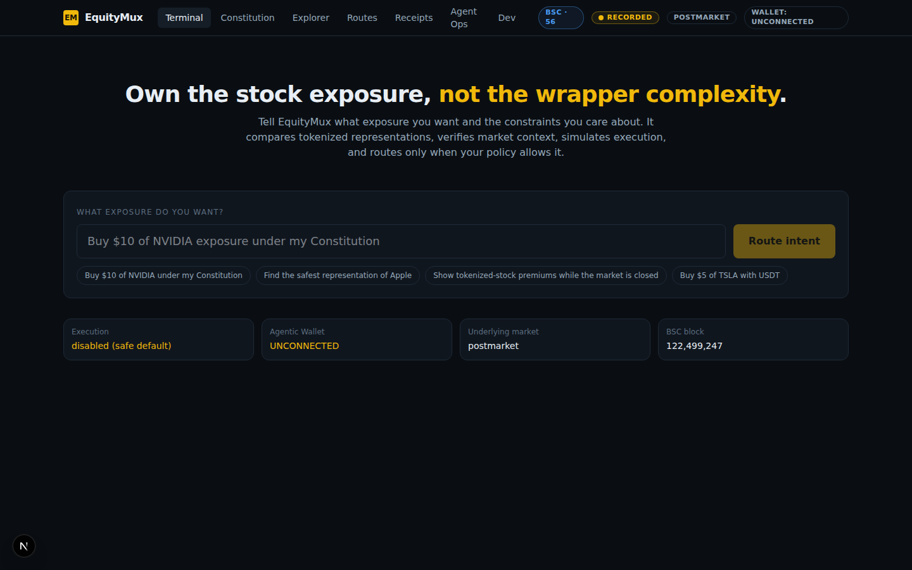

# EquityMux

**The intent and execution router for tokenized stocks.**

> Buying NVIDIA exposure should not require knowing which NVIDIA token to buy.

Users state desired *economic exposure* ("buy $10 of NVDA"). EquityMux
resolves the underlying asset, discovers every tokenized representation on
BSC, collects evidence (reference price, on-chain price, market state,
liquidity, security audit), evaluates all candidates against a deterministic
**Portfolio Constitution**, selects the best valid route, simulates, executes
through the Binance **Agentic Wallet**, and produces a cryptographically
verifiable **Execution Receipt**.

Built for the **BNB Hack: Tokenized Stocks Edition**.

[](https://github.com/tang-vu/equitymux/actions/workflows/ci.yml)



---

## The problem

Tokenized equities fragment the same underlying across issuers:

| Underlying | Ondo | xStocks | bStock |
|---|---|---|---|
| NVIDIA | `NVDAon` | `NVDAx` | `NVDAB` |

Each trades at a different price, with different liquidity, backing model,
and market hours. Asking users to pick the right one by hand is broken UX —
and blind automation without constraints is unsafe. EquityMux sits between
intent and execution: **the LLM interprets language; a deterministic policy
engine — not the model — holds transaction authority.**

```
 intent ──► resolve ──► discover ──► evidence ──► policy ──► tournament
      ──► simulate ──► wallet auth ──► execute ──► verify ──► receipt
```

Every stage emits structured evidence. Every execution produces a
hash-linked receipt. Every unsafe condition **fails closed**.

---

## Architecture

```
apps/web              Next.js 15 frontend — terminal, constitution, explorer,
                      routes, receipts, agent ops, dev status
services/api          Python 3.14 + FastAPI core engine
  equitymux/
    providers/        Binance public RWA API, BSC RPC, token audit,
                      Agentic Wallet CLI boundary
    domain/           canonical equity graph, Decimal math
    policy/           Portfolio Constitution schema + deterministic engine
    services/         pipeline, tournament, receipts, keeper, persistence
    api/              REST surface
services/keeper       BNB Agent Studio agent (ERC-8004/8183, x402 surface)
packages/contracts    Foundry — EquityMuxReceiptRegistry (evidence notary)
fixtures/rwa          recorded API responses — tests + labeled demo mode
docs/                 research, constraints, integration matrix, submission
dx/                   real developer-experience event records
```

## Quickstart

```bash
git clone https://github.com/tang-vu/equitymux
cd equitymux
pnpm install

# backend (Python 3.14 + uv)
pnpm dev:api

# frontend (another terminal)
pnpm dev:web          # http://localhost:3000
```

**Judge fast path:**

```bash
pnpm test:api         # 75 backend tests (fixtures, offline)
pnpm test:web         # 8 frontend tests — canonical-JSON/hash parity vector
pnpm test:contracts   # Foundry receipt-registry tests (4, incl. fuzz)
pnpm verify:live      # read-only live checks — no tx, no wallet needed
pnpm verify:receipt   # receipt provenance proof — dataLabel inside the hash
pnpm dx:summary       # real DX events recorded during development
./scripts/ci-local.sh # the whole pipeline locally
```

Or fully containerized:

```bash
docker compose up --build   # api :8000 + web :3000, execution off by default
```

`verify:live` hits the real Binance public APIs and BSC RPC. It executes
nothing and needs no credentials.

## Live vs recorded

`DEMO_MODE=true` serves `fixtures/rwa` (recorded live responses) with a
visible **RECORDED** badge — for offline judging. The default is live.
Fixtures are never presented as real-time data.

## The Portfolio Constitution

Natural language compiles to a machine-checkable policy:

```json
{
  "maxPremiumOverReferenceBps": 50,
  "maxExpectedSlippageBps": 30,
  "maxQuoteAgeSec": 30,
  "minLiquidityUsd": "10000",
  "marketMustBeOpen": true,
  "allowedPlatforms": ["ondo", "xstocks", "bstock"],
  "spotOnly": true,
  "simulationRequired": true
}
```

System ceilings (`.env`) cannot be loosened by any constitution. Candidates
get explicit pass/fail reasons — never a black box.

## Execution safety

`EXECUTION_ENABLED=false` is the **default kill switch**. A mainnet trade
additionally requires: connected Agentic Wallet, chainId 56, allowed platform,
fresh quote, passing simulation, constitution pass, and human confirmation.
`verify:mainnet-execution` is the only path that moves funds, and it types
`EXECUTE` interactively.

## Status

| Component | Status |
|---|---|
| RWA discovery (3 platforms, BSC) | ✅ verified live — 510 underlyings indexed |
| Constitution + policy engine | ✅ 75 tests |
| Route tournament | ✅ tested; live run scored all 3 NVDA reps with explicit reasons |
| Receipt registry contract | ✅ forge tests pass; testnet deploy simulated (343,595 gas) |
| Keeper (BNB Agent Studio) | ✅ canonical `bag` scaffold — `bag doctor` PASS, tsc clean |
| Agentic Wallet execution | ⏸ blocked — wallet signin required |
| Deploy (web+api) | ⏸ host choice pending; Dockerfiles + compose verified |

See `docs/research/integration-matrix.md` for the honest, per-feature matrix.

## Honesty contract

Nothing in this repo claims to work that hasn't been tested. Wallet-dependent
paths are labeled `BLOCKED` with exact reproduction steps. Recorded fixtures
are labeled `RECORDED`. There are no fake integrations.
